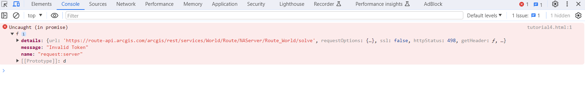

Bug Report: ESRI API key 

Title: The API key doesnt work as prompted to do in ESRI documentation.

Steps for the bug:
  1) Create a API key and creating an ESRI tutorial from the ESRI documentation
     https://developers.arcgis.com/javascript/latest/get-started/
  2) The API key doesnt work with the provided JS in the documentation and throws JS error in the console and displays none in the map.

     
 
  4) The url for the route tutorial doesnt work and throws that error:
     https://route-api.arcgis.com/arcgis/rest/services/World/Route/NAServer/Route_World

The environments are:
  1) Google chrome
  2) Microsoft Edge.
